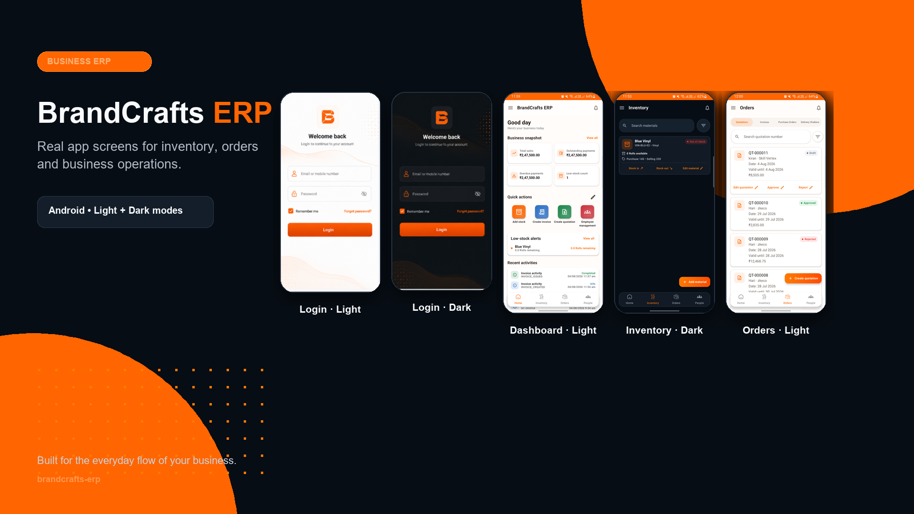

# BrandCrafts ERP

Mobile ERP for inventory, quotations, invoices, purchase orders, delivery challans, and people operations. The banner uses real application screens; open it to view the complete Light and Dark screenshot gallery.

## Documentation Index

## Business

01_PROJECT_OVERVIEW.md

02_FUNCTIONAL_REQUIREMENTS.md

08_WORKFLOWS.md

---

## Architecture

03_ARCHITECTURE.md

04_FIRESTORE_SCHEMA.md

05_RBAC.md

---

## UI

06_UI_GUIDELINES.md

07_SCREEN_SPECIFICATIONS.md

09_DESIGN_SYSTEM.md

---

## Development

10_DEVELOPMENT_GUIDELINES.md

13_FOLDER_STRUCTURE.md

14_IMPLEMENTATION_PHASES.md

15_AI_DEVELOPMENT_PLAYBOOK.md

---

## Firebase

11_API_CONTRACTS.md

12_FIREBASE_SECURITY_RULES.md

16_FIREBASE_SETUP_GUIDE.md
