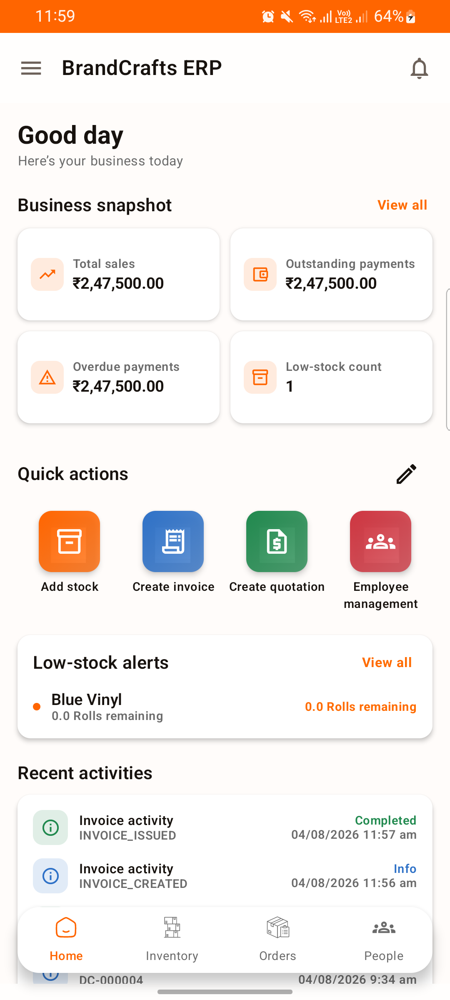
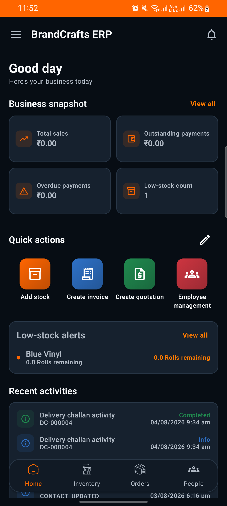
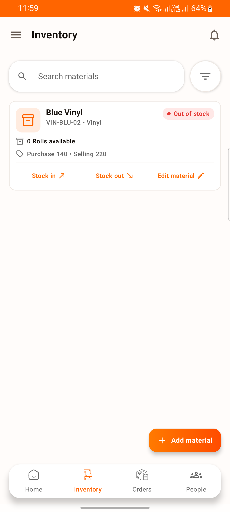
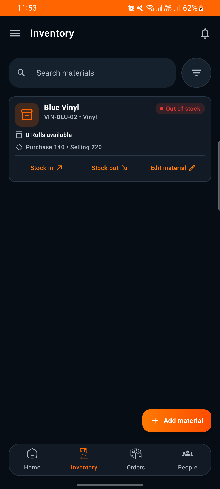

# BrandCrafts ERP — Real App Screens

The banner above is composed only from real app captures. The Login, Dashboard, Inventory, and Orders panels have not been mocked or redrawn.

These are unedited screenshots from the BrandCrafts ERP Android app, selected for client demos and GitHub documentation. They demonstrate the implemented Light and Dark themes, live dashboard layout, inventory search, stock status, and responsive bottom navigation.

## Dashboard

| Light mode | Dark mode |
| --- | --- |
|  |  |

## Inventory

| Light mode | Dark mode |
| --- | --- |
|  |  |

## Client-facing summary

BrandCrafts ERP gives growing businesses a focused mobile workspace for inventory visibility, invoices, quotations, purchase orders, delivery challans, and people operations—available in both Light and Dark themes.
